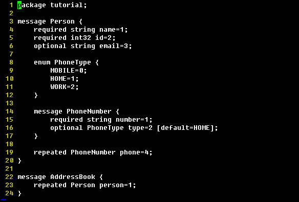
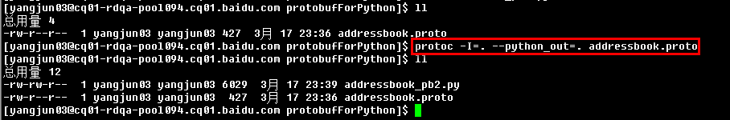
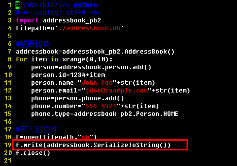
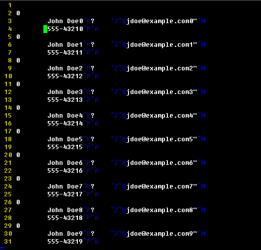
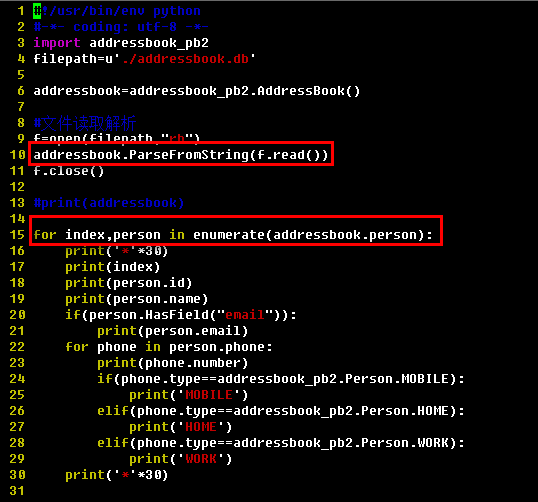

protobufForPython
=================

### Introduction:
an example of google ptotobuf for reading and writing with python.

### Feature:
* example of proto file definition.
* example of proto file compile to python file.
* example of protobuf writing from python object to bytes stream.
* example of protobuf reading from bytes stream to string or python object.
    
### UpdateRecords:
* 1.0——base version.
    
### Dependencies:
* protobuf=>>http://code.google.com/p/protobuf/
    
### Screenshots:    
**1.screenshot of proto file definition:**

**2.screenshot of proto file compile:**

**3.screenshot of data writing:**

**4.screenshot of saved data file:**

**5.screenshot of saved data file reading and parse:**

### Kindly Reminder:
If any questions, please contact JunneYang 597092663@qq.com.

